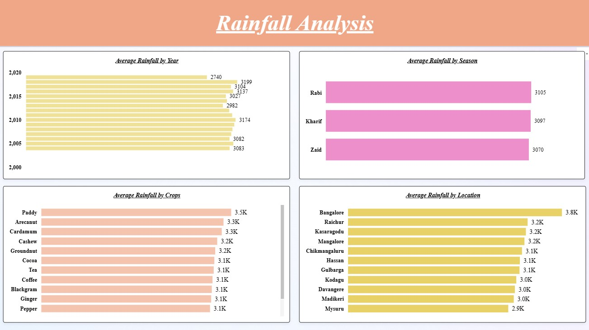
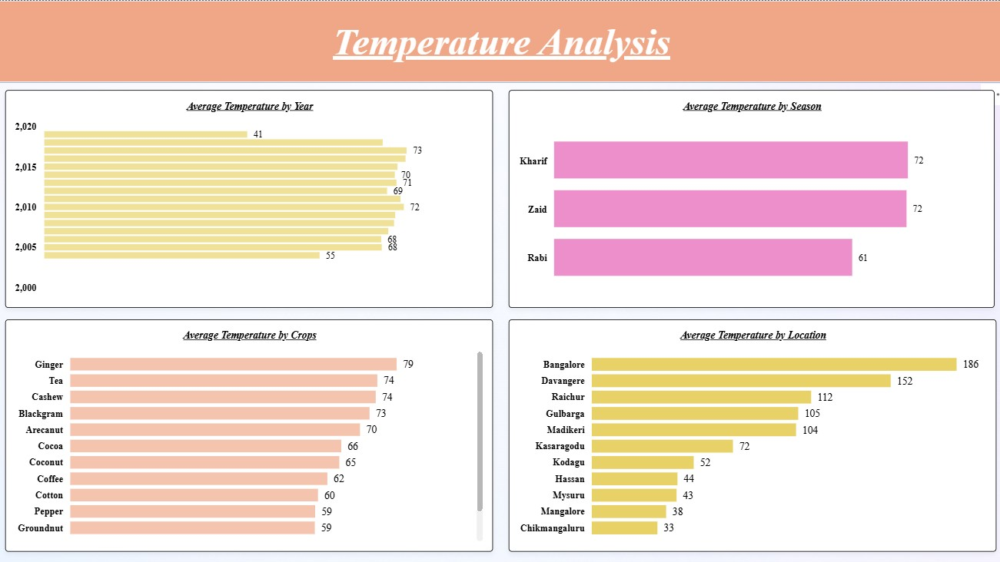
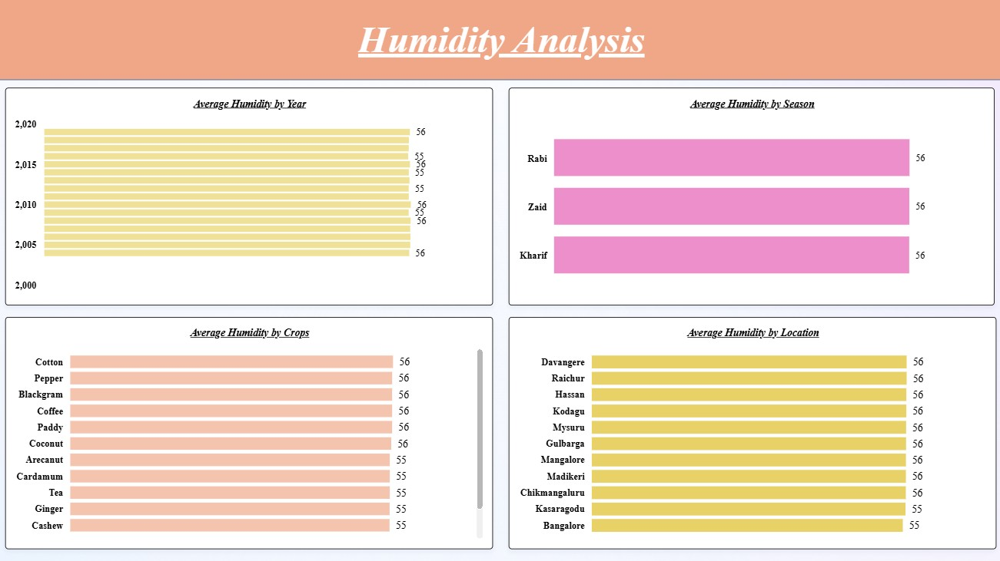
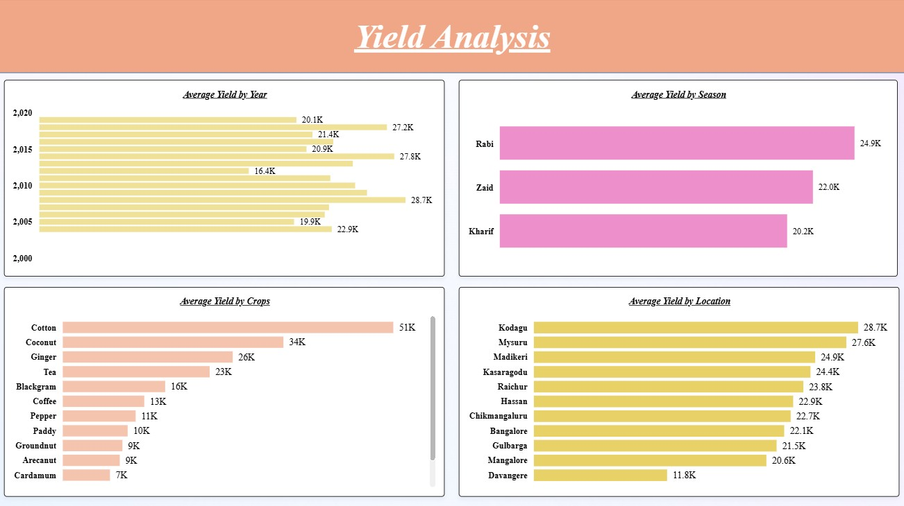

# Agriculture and Rainfall Analysis in India 🌾☔ - aws-s3-snowflake-powerbi-Project

### 🎯 Project Overview

This project demonstrates a **comprehensive data engineering and business intelligence workflow** by analyzing rainfall patterns and their impact on agricultural metrics across India. The project illustrates the full lifecycle of data—from raw ingestion and cloud storage to transformation in a cloud data warehouse and interactive visualizations—providing actionable insights for stakeholders in the agriculture sector.

---

### ⚙️ Technologies & Tools

- **AWS S3** – Cloud storage for raw dataset ingestion.  
- **Snowflake** – Cloud-based data warehouse for secure storage, transformation, and analytics.  
- **SQL** – Data manipulation, transformation, and analytical table creation in Snowflake.  
- **Power BI** – Interactive dashboards and visualizations for business intelligence reporting.

---

### 🪜 Workflow & Implementation Steps

#### **Step 1: AWS S3 Bucket and Snowflake Integration**
- Stored the raw dataset (`data_season.csv`) in an S3 bucket: `powerbi.project45`.  
- Configured **Snowflake storage integration** using `PBI_Integration` with the AWS IAM role: `arn:aws:iam::149561018143:role/powerbi.role`.  
- Ensured secure access between Snowflake and S3 for seamless data ingestion.

#### **Step 2: Data Ingestion & Transformation in Snowflake**
- Created a dedicated **database (`PowerBI`)** and **schema (`PBI_Data`)** for project organization.  
- Defined table `PBI_Dataset` mirroring CSV structure: `Year`, `Location`, `Rainfall`, `Crops`, and `Season`.  
- Loaded data from S3 using `COPY INTO` command via the `pbi_stage`.  

**Data Transformation Highlights:**  
- Added **`Year_Group`** and **`Rainfall_Group`** columns for categorization.  
- Adjusted numerical values: increased `Rainfall` by 10% and decreased `Area` by 10% for simulation purposes.  
- Classified `Year_Group` into three ranges: `Y1`, `Y2`, `Y3`.  
- Categorized `Rainfall_Group` into `'Low'`, `'Medium'`, and `'High'` based on thresholds.  

#### **Step 3: Power BI Reporting**
- Connected the transformed `agriculture` table in Snowflake to **Power BI**.  
- Built an interactive report highlighting:  
  - Rainfall patterns by region and season.  
  - Crop yield variations corresponding to rainfall levels.  
  - Analytical insights for agricultural planning.  
- Enabled stakeholders to make data-driven decisions with dynamic visualizations.

---

### 📖 Key Learnings & Skills Developed

- **Cloud Data Integration:** Hands-on experience connecting **AWS S3** with **Snowflake** securely using IAM roles and storage integrations.  
- **SQL Data Engineering:** Executed complex **SQL transformations**, including column creation, value adjustments, and group classification.  
- **Business Intelligence & Reporting:** Designed actionable, interactive dashboards in **Power BI**, demonstrating end-to-end analytics.  
- **Analytical Thinking:** Applied logical grouping and categorization techniques to extract meaningful insights from raw agricultural and rainfall data.  

---

### 📁 Project Artifacts

| File | Description |
|------|-------------|
| `data_season.csv` | Raw dataset containing rainfall and crop information. |
| `worksheet.sql` | Complete Snowflake SQL script for integrations, database setup, table creation, and transformations. |
| `Rainfall Analysis.pbix` | Power BI report file showcasing final visualizations and insights. |

---

### 🖼️ Visualizations

Below are key visual insights captured from the Power BI report:

| Screenshot | Description |
|------------|-------------|
|  | Rainfall Analysis: Average rainfall by year, season, crop, and location across India. |
|  | Temperature Analysis: Average temperature trends by year, season, crop, and location. |
|  | Humidity Analysis: Average humidity by year, season, crop, and location. |
|  | Yield Analysis: Average crop yield by year, season, crop, and location with interactive filters. |

> **Note:** Replace `images/screenshotX.png` with the actual filenames of your saved screenshots.

---

### 🚀 Impact & Applications

This project highlights **how cloud data engineering and BI workflows can drive agricultural insights**. Potential applications include:  
- Crop yield forecasting based on rainfall trends.  
- Regional planning for irrigation and resource allocation.  
- Integration with predictive analytics models for precision agriculture.
